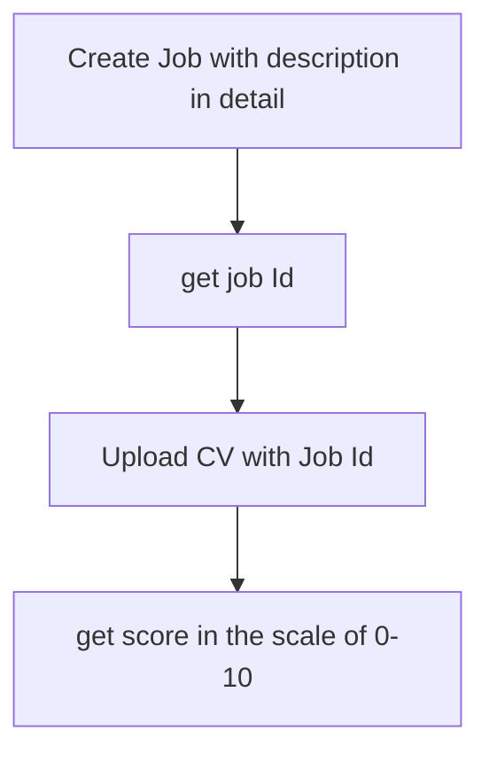

# CVScore
Sorting and scoring CVs based on job descriptions using FastAPI, LangChain, and LLMs

## System flow:

```mermaid
graph TD;
    A[Create Job with description in detail] --> B[get job Id]
    B --> C[Upload CV with Job Id]
    C --> D[get score in the scale of 0-10]
```