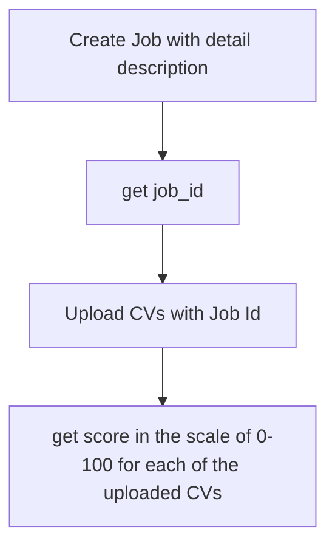

# CVScore
Sorting and scoring CVs based on job descriptions using FastAPI, LangChain, and LLMs

## Set Up

```sh
conda create --name cv-score python=3.11

conda activate cv-score

pip install -r requirements.txt 

python main.py
```

## System flow:


